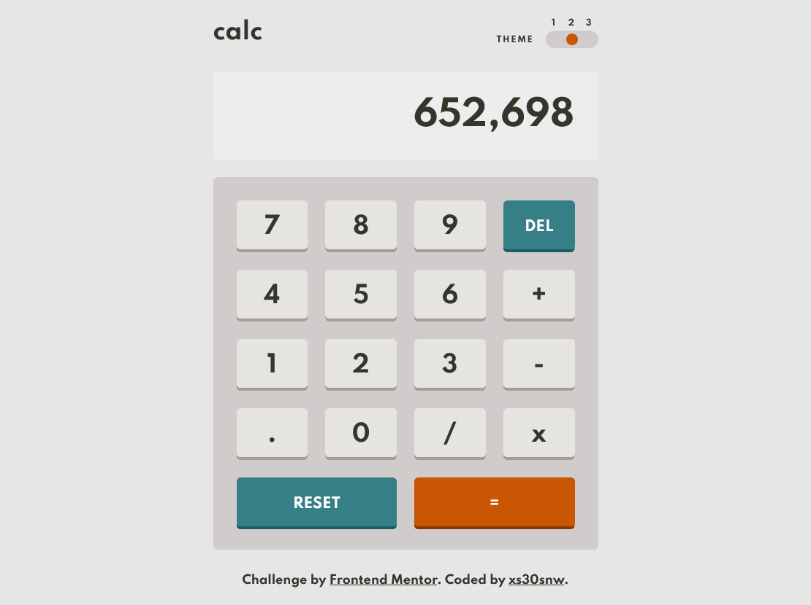

# Calculator App

My solution to [Calculator App Challenge](https://www.frontendmentor.io/challenges/calculator-app-9lteq5N29). The app has three themes and can be used to perform simple algebraic operations.

- Live Site URL: [GitHub Pages](https://xs30snw.github.io/FEM_calculator/)

## Technologies

- Webpack bundler,
- Esbuild,
- React,
- TypeScript.

## Screenshot

## Additional info

Theme switcher is partially inspired by [CodePen by Davide Sandonà](https://codepen.io/Davide_sd/pen/XWGOxZ) and [article by Adam Argyle](https://web.dev/building-a-switch-component/). Browser stores the preference for a selected theme in *localStorage*.

## Tested

- Win 10, Chrome v101, Firefox v100. 

## Ideas for improvement

- [ ] fix overflow errors;
- [ ] simpler app logic;
- [ ] show pending operation;
- [ ] fit into screen vertically(?), adjust responsive layout;
- [ ] accessibility;
- [ ] notification for storing cookies.